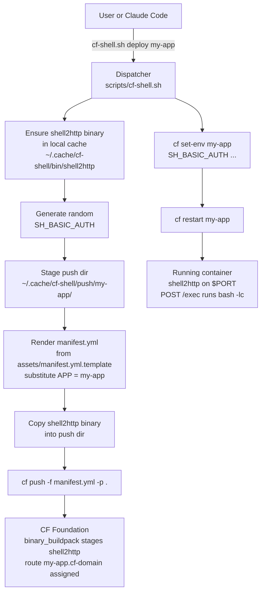
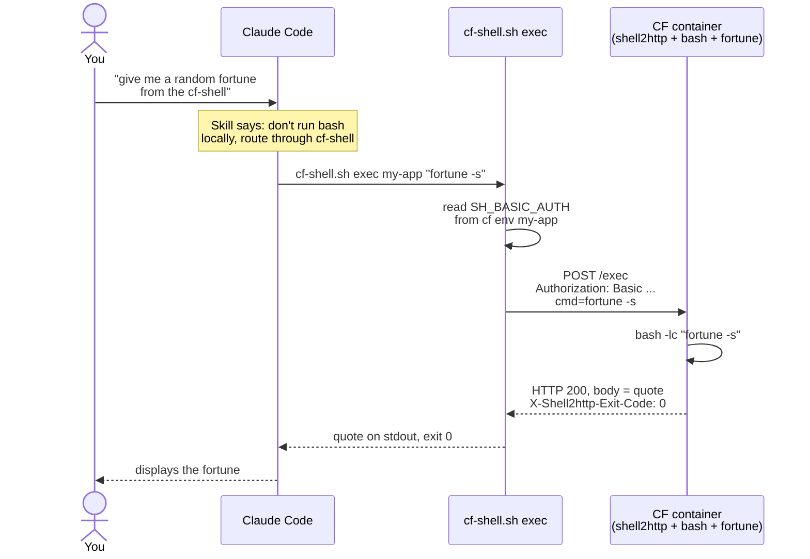

# cf-shell

A Claude Code skill that provisions a throwaway `bash` shell on any
Cloud Foundry foundation and lets Claude run commands through it
over HTTPS. Built on [shell2http](https://github.com/msoap/shell2http).

## Why

Claude Code can already run shell commands locally. `cf-shell`
reroutes those commands into a CF-hosted container instead  -  so
they run on platform hardware, inside a buildpack-staged image,
with access to platform services and marketplace through bindings,
and with the audit trail / observability a platform gives you.

Everything the skill does is a normal `cf push` + `cf curl` dance.
No custom CF plugins, no patched server components.

## Prerequisites

- `bash` (4.0+), `curl`, `jq` on your `$PATH`.
- `cf` CLI v8+ (download: https://github.com/cloudfoundry/cli/releases).
- A Cloud Foundry foundation with `cf target` already succeeded  -  the
  skill never calls `cf login` / `cf auth`, that's your responsibility.
- Claude Code (https://www.anthropic.com/claude-code) for the skill
  itself.

## Install

Two paths, pick one.

**From a released zip** (easiest):

```bash
# Download skill-cf-shell.zip from the project's GitHub Releases,
# then:
mkdir -p ~/.claude/skills
unzip skill-cf-shell.zip -d ~/.claude/skills/
```

**From a clone** (if you want to hack on it):

```bash
git clone https://github.com/cote/skill-cf-shell ~/dev/skill-cf-shell
cd ~/dev/skill-cf-shell
bash build.sh                           # stages target/cf-shell/ + target/skill-cf-shell.zip
mkdir -p ~/.claude/skills
unzip target/skill-cf-shell.zip -d ~/.claude/skills/
```

Or skip the zip and copy the source dir directly:

```bash
cp -r ~/dev/skill-cf-shell/src/cf-shell ~/.claude/skills/
chmod u+x ~/.claude/skills/cf-shell/scripts/*.sh
```

Verify:

```bash
ls ~/.claude/skills/cf-shell/
# expect: SKILL.md  assets/  references/  scripts/
```

## Quickstart

With `cf target` pointed at a foundation + space you have
`SpaceDeveloper` on, either ask Claude:

> Stand up a Cloud Foundry-hosted shell and run `uname -a` through it.

or drive the dispatcher directly:

```bash
bash ~/.claude/skills/cf-shell/scripts/cf-shell.sh preflight
bash ~/.claude/skills/cf-shell/scripts/cf-shell.sh deploy my-shell
bash ~/.claude/skills/cf-shell/scripts/cf-shell.sh exec my-shell 'uname -a; whoami; ls /'
bash ~/.claude/skills/cf-shell/scripts/cf-shell.sh destroy my-shell
```

`SKILL.md` has the full command reference. `references/cf-cheatsheet.md`
is a short `cf` CLI reference for when you'd rather skip the
dispatcher and use `cf` directly (often cleaner for extending
buildpacks or binding services).

## How it works

### Deploy flow

What `cf-shell.sh deploy my-app` actually does:



### Exec flow - fortune of the day

Claude Code in a session where the skill is loaded is nudged to route
shell work through `cf-shell` instead of its local Bash tool. Here's
what happens when you ask for a `fortune`. `fortune` isn't in the
base `cflinuxfs4` stack, so this assumes you already extended the
container with `fortune-mod` via `apt-buildpack` (see
[`references/extending.md`](src/cf-shell/references/extending.md)).



## Reducing permission prompts

Most of the `cf` commands the skill uses are read-only or safe
deploy/run calls. `assets/settings.json.example` is a ready-to-use
allowlist of those. Destructive calls (`cf delete*`, `cf auth`,
`cf login`) are deliberately **not** in it  -  those always prompt.

Three places to drop the contents (Claude Code merges all three at
startup):

| Destination | Scope | Commit? |
|---|---|---|
| `<project>/.claude/settings.json` | This project, team-shared | Yes |
| `<project>/.claude/settings.local.json` | This project, your machine only | No (gitignored) |
| `~/.claude/settings.json` | Global, all projects | n/a |

Example  -  drop into a project's committed settings:

```bash
mkdir -p .claude
cp ~/.claude/skills/cf-shell/assets/settings.json.example \
   .claude/settings.json
```

Or use `jq` to merge with an existing `settings.json`:

```bash
jq -s '.[0] * {permissions: {allow: (.[0].permissions.allow + .[1].permissions.allow)}}' \
   .claude/settings.json ~/.claude/skills/cf-shell/assets/settings.json.example \
   > .claude/settings.json.new && mv .claude/settings.json.new .claude/settings.json
```

## Keeping the skill's state project-local

The dispatcher caches `shell2http` and per-app push dirs
[XDG style](https://specifications.freedesktop.org/basedir/latest/)
at `${XDG_CACHE_HOME:-$HOME/.cache}/cf-shell/`. For a one-project
demo or to keep everything under one project tree, point
`XDG_CACHE_HOME` at the project:

```bash
export XDG_CACHE_HOME=$PWD/.cache
```

Cache then lands under `$PWD/.cache/cf-shell/`. Combined with a
project-scoped `.claude/settings.json`, this makes the skill's
filesystem footprint entirely project-local.

## Security

The skill generates a random 24-character basic-auth credential
(`SH_BASIC_AUTH`), stores it only in `cf env`, and uses it for every
`exec`. See [`SECURITY.md`](SECURITY.md) for the full threat model  - 
what the skill guards, what it doesn't, and what to do if you want
real per-user auth on top.

One critical gotcha: if you `cf push` the app yourself (bypassing
`cf-shell.sh deploy`) to extend its buildpacks, the new droplet
starts with **no basic-auth set** and `/exec` is briefly open to the
internet. Run `cf-shell.sh secure <app>` immediately after any such
push to lock it down. Or just use `cf-shell.sh deploy` first and
then edit the generated push dir.

## Tests

Three scenario-style tests under `tests/scenarios/`. Each has a
`PROMPT.md` you hand to a fresh Claude Code session, synthetic
input fixtures, and an `expected-output.md` for grading:

- `01-sed-awk/`  -  sed/awk on a CSV (base stack, fastest).
- `02-run-script/`  -  write+run a script in the container
  (filesystem-persistence quirk).
- `03-ocr-extend/`  -  extend the container with apt + python for OCR
  (the "can the model drive a buildpack extension" test).

`tests/scenarios/cleanup.sh` tears down any `cfsh-*` apps + local
push dirs between runs.

## Repo layout

```
src/cf-shell/                 <- the skill (copy into ~/.claude/skills/)
  SKILL.md                    <- manifest + command reference
  scripts/
    cf-shell.sh               <- dispatcher (preflight, deploy, exec, ...)
    upload.sh                 <- chunked base64 upload helper
  references/
    extending.md              <- buildpack extension cookbook
    cf-cheatsheet.md          <- small cf CLI reference
  assets/
    settings.json.example     <- copy-paste permission allowlist
    manifest.yml.template     <- base `cf push` manifest used by `deploy`
tests/
  scenarios/                  <- 3 scenario-style tests
  run.sh                      <- harness stub
build.sh                      <- one-command build into target/skill-cf-shell.zip
SECURITY.md                   <- threat model + security guarantees
CHANGELOG.md
LICENSE
README.md                     <- this file
```

## License

MIT. See [`LICENSE`](LICENSE). shell2http, which the skill downloads
and pushes into the CF container, is also MIT
(https://github.com/msoap/shell2http).
